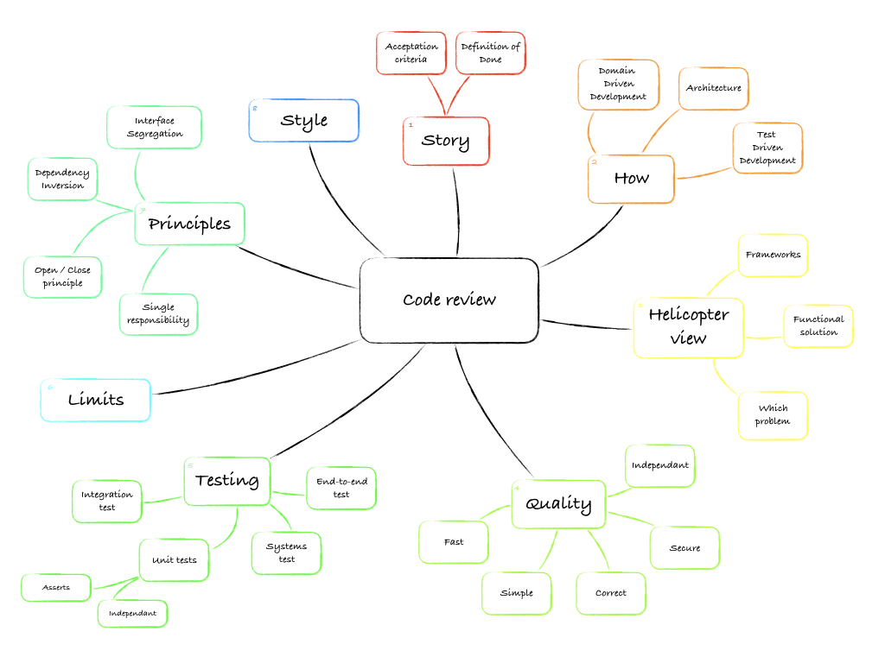
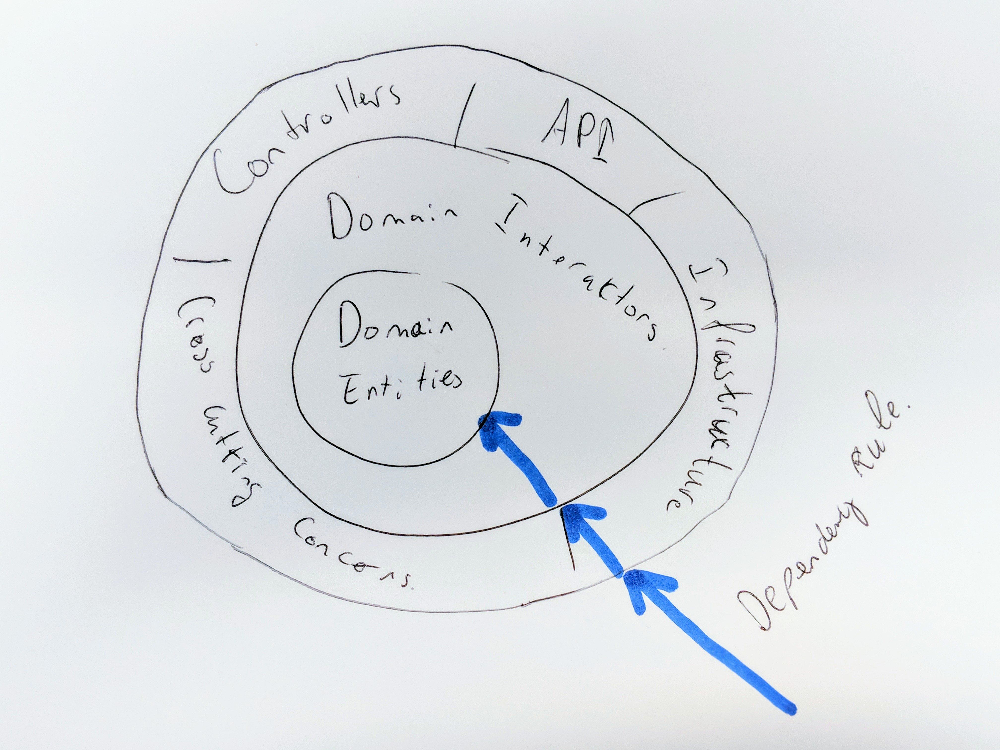

# Code convention - CaseNine



## First

Based upon the Google Java Style Guide: [https://google.github.io/styleguide/javaguide.html](https://google.github.io/styleguide/javaguide.html)

We have a few Apex specials that are described in this document.


## Content

* [Story](#story)
* [Architecture](#architecture)
* [Quality](#quality)
    * [Triggers](#triggers)
* [Testing](#testing)
    * [About the use of fakes](#about-the-use-of-fakes)
    * [About Test.start/stopTest](#about-test.start/stoptest)
    * [About Triggers](#about-triggers)
* [Principles](#principles)
    * [Use of repositories](#use-of-repositories)
* [Limits](#limits)
* [Style](#style)
    * [Sobject initialization](#sobject-initialization)
    * [SOQL Query](#soql-query)
    * [Column limit](#column-limit)
    * [Salesforce API names](#salesforce-api-names)


## Story


## Architecture

The direction of dependencies always go outside in:



1. API's, Controllers, Infrastructure (repositories for example), or crosscutting concerns
2. Domain interactors
3. Domain entities

Reference: [The Clean Architecture](https://8thlight.com/blog/uncle-bob/2012/08/13/the-clean-architecture.html)

Quote:
> So what does the architecture of your application scream? When you look at the top level directory structure, and the source files in the highest level package; do they scream: Health Care System, or Accounting System, or Inventory Management System? Or do they scream: Rails, or Spring/Hibernate, or ASP?  

Reference: [Screaming Architecture](https://8thlight.com/blog/uncle-bob/2011/09/30/Screaming-Architecture.html)


## Quality


Reference: [Simple, correct, fast: in that order](https://drewdevault.com/2018/07/09/Simple-correct-fast.html)


### Triggers
Because Salesforce does not enforce any particiary order in which triggers are executed, only write one trigger per SObject. 
That way you are in control of the order in which things are executed. 


## Testing


### About the use of fakes
All database interactions require fakes in order to test application classes that use repositories. All Test classes 
should have `@IsTest(IsParallel=true)`, except repository test classes, because they need the database by nature.
A few common database interactions:
- DML statements as insert, update, upsert, delete, merge  - use repositories
- SOQL queries - use repositories
- SOSL search queries - use repositories
- `Test.getStandardPricebookId()` - generate an id yourself
- `System.schedule()` - write a wrapper interface and fake implementation to avoid database interactions
- `System.scheduleBatch()` - write a wrapper interface and fake implementation to avoid database interactions
- `System.enqueueJob()` - write a wrapper interface and fake implementation to avoid database interactions

### About Test.start/stopTest 
Another thing, only use `Test.startTest()` & `Test.stopTest()` when needed. This is because `Test.stopTest()` lets 
Salesforce test execution wait on all queued jobs to be completed. Most often you don't need those jobs to be completed, 
because you want to mock the scheduling, queuing, starting of jobs to be faked and you only want to assert that the 
job has been properly queued or scheduled.


### About Triggers
By nature Salesforce needs at least one test for a database trigger. Because we most often test the repositories against the database
you actually don't any additional tests for database triggers. The business logic that's executed in the trigger should be 
kept out of the trigger and be put in domain classes.  


## Principles

In order to make clean code, use the following principles of SOLID:
- SRP: Single Responsibility Principal
- OCP: Open/Close Principal
- LSP: Liscov Substitution Principal
- ISP: Interface Segregation Principle
- DIP: Dependency Inversion Principle

### Use of repositories

Repositories are samples of implementing the Dependency Inversion Principle.

The use of repositories is a must in order to execute SOQL queries or DML statements. So all interactions with the 
database will be done in these repositories and not directly in business logic classes.

In addition, the unit test classes will use fake mock repositories instead, so the use of interfaces for 
repositories is also required.


## Limits


## Style


### Sobject initialization

We see a Sobject initialization as an initialization of a `Map<Y, Z>`. 
How you can see a Map or List construct like: https://google.github.io/styleguide/javaguide.html#s4.8.3.1-array-initializers. 
So we assume that a Sobject initialization is a Block-like construct. (https://google.github.io/styleguide/javaguide.html#s4-formatting)
```java
Message__c message = new Message__c(
  User__c = user.Id,
  RecordTypeId = recordTypeId,
  Status__c = 'Started',
  Send_Method__c = 'API',
  Type__c = 'Invoice',
  Start_Date__c = Date.today()
);
```


### SOQL Query

We see a query as a non-block-like statement. So here you must use continuation indents: 
( [https://google.github.io/styleguide/javaguide.html#s4.5.2-line-wrapping-indent](https://google.github.io/styleguide/javaguide.html#s4.5.2-line-wrapping-indent))
```java
List<Message__c> messages = [
    SELECT Name
    FROM Message__c
    WHERE User__c = :originalMessage.User__c
        AND Type__c = :originalMessage.Type__c
        AND Started__c = false
        OR Item__c = 'Test case'
];
```


### Column limit

We currently use a column limit of 120. And not the 80/100 from Google. This because it fits better within the use of Apex.
Reference: [http://google.github.io/styleguide/javaguide.html#s4.4-column-limit](http://google.github.io/styleguide/javaguide.html#s4.4-column-limit)


### Salesforce API names

All API names are written in [PascalCase](http://wiki.c2.com/?PascalCase).
For example, `FieldTest__c` or `FakeObject__c`.
